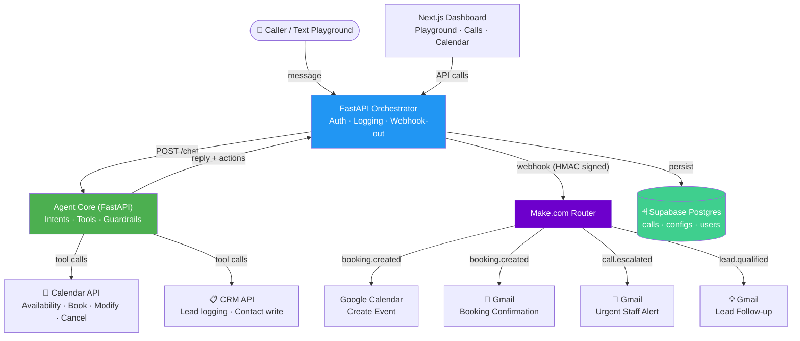

# 📞 Ringback — Text-First AI Voice Agent for Home Services

[](https://opensource.org/licenses/MIT)
[](https://python.org/)
[](https://fastapi.tiangolo.com/)
[](https://nextjs.org/)
[](https://postgresql.org/)
[](https://supabase.com/)
[](https://make.com/)

> **"Never miss a call, never miss a booking."**

Ringback is an inbound AI voice agent for **home-services** businesses (plumbing, HVAC, electrical, cleaning). It answers 24/7, books/reschedules/cancels appointments, answers FAQ, qualifies leads, writes to calendar/CRM, and hands off to a human when it should.

Built entirely with a **text-first methodology** — proving the conversation core in text before touching voice — and gated by a regression eval harness that enforces 100% task success and 0% false-action rate in CI.

🔗 **Live Demo:** [ringback-web.vercel.app](https://ringback-web.vercel.app/)
🔗 **Developer Portfolio:** [portfolio-shayan-hussain.vercel.app](https://portfolio-shayan-hussain.vercel.app/)

---

## 📑 Table of Contents
- [Key Features](#-key-features)
- [The Text-First Methodology](#-the-text-first-methodology)
- [System Architecture](#-system-architecture)
- [Tech Stack](#-tech-stack)
- [Monorepo Layout](#-monorepo-layout)
- [Getting Started (Local Setup)](#-getting-started-local-setup)
- [Hard Rules (Enforced in Code)](#-hard-rules-enforced-in-code)
- [Automation (Make.com / n8n)](#-automation-makecom--n8n)
- [Production Deployment](#-production-deployment)
- [Status & Documentation](#-status--documentation)

---

## ✨ Key Features

- 🎯 **Text-First Conversation Core:** Channel-agnostic intents, tools, guardrails, and confirmation — proven in text with a regression eval set before voice is ever added. Voice = STT → same core → TTS.
- 🛡️ **Wired Behavioral Guardrails:** `assert_confirmed()` blocks writes without spoken confirmation; `assert_slot_offered()` prevents fabricated availability. Both tested in CI — not just defined, but called.
- 📊 **Eval-Gated CI:** Every PR runs `python -m evals.run --ci` — 14 scenarios covering book, reschedule, cancel, FAQ, qualify, and escalate. Below threshold = blocked.
- 🔧 **Vertical as Config:** Services, hours, FAQ, escalation rules live in YAML. Switch from home-services to clinics with one env var — `VERTICAL=clinic` — no code change.
- ⚡ **No-Code Automation Seam:** HMAC-signed webhooks fire `booking.created`, `call.escalated`, `lead.qualified` to Make.com/n8n → Google Calendar events + email notifications — zero integration code.
- 🔒 **Tenant-Scoped SaaS Shell:** JWT auth, workspace isolation, encrypted credential storage (Fernet), call logging, configuration, integrations dashboard.

---

## 📐 The Text-First Methodology

Voice minutes cost money. Conversation logic bugs show up identically in text. We build the eval harness first, prove the core in text, then add voice as a thin wrapper.

| Phase | What Ships | Gate |
| :--- | :--- | :--- |
| **Phase 0** | Foundation — repo, docs, SaaS shell, Docker, CI stub | ✅ Complete |
| **Phase 1** | Text agent core — intents, tools, guardrails, confirmation, escalation | ✅ Complete |
| **Phase 2** | Real integrations — calendar/CRM interfaces, webhook seam, encrypted creds | 🟡 Interfaces ready |
| **Phase 3** | Regression evals — **THE GATE before voice** | ✅ 14/14 passing |
| **Phase 4** | Product surfaces — playground, calls, calendar, dashboard, config | ✅ Complete |
| **Phase 5** | Voice layer — telephony + STT/TTS (deliberately deferred) | 🔒 Blocked on spend caps |
| **Phase 6** | Ship — free-stack deploy, billing alarms, CI/CD to platforms | 🟡 Deployed |

---

## 🏗️ System Architecture



### Request Flow
1. **Input:** Caller sends a message through the web playground (or, later, via telephony STT).
2. **Orchestrator:** Authenticates, routes to the agent core, logs the call.
3. **Agent Core:** Classifies intent → calls tools (calendar/CRM) → applies guardrails → requests confirmation → returns reply + actions.
4. **Webhook:** On call completion, the orchestrator fires a signed event to Make.com.
5. **Automation:** Make routes by event type → creates calendar events, sends emails, alerts staff.
6. **Persistence:** Call log (transcript, intent, outcome, actions) is stored tenant-scoped in Postgres.

---

## 🛠️ Tech Stack

| Layer | Technology |
|---|---|
| **Conversation Core** | Python 3.10+, FastAPI, rule-based NLU (deterministic) with Groq/Gemini swap |
| **Orchestrator** | FastAPI, JWT Auth, HMAC webhooks, Fernet encryption |
| **Web Dashboard** | Next.js 14 (App Router), React, TypeScript |
| **Database** | PostgreSQL (Supabase), transaction pooler `:6543` |
| **Automation** | Make.com (Google Calendar, Gmail, Router) |
| **LLM** | Groq (generation), Gemini (optional), rule-based (CI/evals) |
| **Deployment** | Vercel (web), Render free (agent + orchestrator), UptimeRobot |
| **CI/CD** | GitHub Actions → lint + tests + eval gate |

---

## 📁 Monorepo Layout

```
agent/            Python — the text-first conversation core (the "brain"). Its own FastAPI
                  service exposing POST /chat. Text AND voice both call this exact core.
orchestrator/     FastAPI — auth (JWT), tenant/workspace scoping, config, call logging,
                  text playground endpoint, Make.com webhook-out. Persists everything.
voice/            Phase 5 ONLY (not built). Telephony + streaming STT/TTS bridge behind
                  a provider interface. Calls the same agent /chat.
web/              Next.js — SaaS shell: landing, pricing, auth, dashboard, calls, calendar,
                  playground, configuration, integrations, settings.
packages/ui/      Shared React UI kit.
db/               Schema + migrations (every table tenant-scoped).
docs/             PRD, provider verification, deployment guide, automation guide.
```

---

## 🚀 Getting Started (Local Setup)

### Prerequisites
- Python 3.10+ & Node.js 20+
- Docker & Docker Compose

### 1. Clone the repository
```bash
git clone https://github.com/SShayanHussain/ringback.git
cd ringback
```

### 2. Setup Environment Variables
```bash
cp .env.example .env
```
The defaults run **key-free** (deterministic rule-based LLM provider), so tests and evals work without any API key. Set `LLM_PROVIDER=groq` + `GROQ_API_KEY=gsk_...` for real NLU.

### 3. Start Local Infrastructure
```bash
docker compose up
```
This starts: PostgreSQL, Redis, Agent Core (`:8001`), Orchestrator (`:8000`), Web (`:3000`).

### 4. Run Tests & Evals
```bash
# Run the conversation core unit tests
make agent-test

# Run the Phase 3 regression eval gate
make evals

# Free text REPL against the agent core (no voice spend)
make playground
```

### 5. Access the App
| Service | URL |
|---|---|
| Web Dashboard | http://localhost:3000 |
| Orchestrator API | http://localhost:8000 |
| Agent Core | http://localhost:8001 |

---

## 🔒 Hard Rules (Enforced in Code + Tests)

These are non-negotiable and verified in CI:

1. **Never fabricate availability** — only slots the calendar tool actually returns. (`test_no_fabricated_availability.py`)
2. **No state-changing action without confirmation** — book/cancel require an explicit confirm turn. (`test_no_write_without_confirmation.py`)
3. **Facts from tools only** — hours, prices, services, FAQ come from the vertical config via tools, never model memory.
4. **Scope lock** — off-domain requests are refused/transferred, never improvised.
5. **Telephony spend cap + alarm before any voice deploy.**

---

## ⚡ Automation (Make.com / n8n)

The agent core fires a single **HMAC-signed webhook** for CRM writes + notifications. Build the flows in your no-code tool:

```
Webhook → Router ─┬─ booking.created  → Google Calendar + Email
                   ├─ call.escalated   → 🚨 Urgent Staff Alert
                   └─ lead.qualified   → 💡 Lead Follow-up Email
```

Each event carries enriched data: `service`, `start_label`, `contact_name`, `contact_phone`, `address`, `notify_email` — everything the downstream flow needs without a callback.

Full setup guide: [docs/AUTOMATION-GUIDE.md](docs/AUTOMATION-GUIDE.md)

---

## 🌐 Production Deployment

Fully-free stack — no AWS:

| Service | Platform | URL |
|---|---|---|
| Web (Next.js) | **Vercel** | [ringback-web.vercel.app](https://ringback-web.vercel.app/) |
| Agent Core (FastAPI) | **Render** free | [ringback-agent.onrender.com](https://ringback-agent.onrender.com) |
| Orchestrator (FastAPI) | **Render** free | [ringback-orchestrator.onrender.com](https://ringback-orchestrator.onrender.com) |
| Database | **Supabase** | Transaction pooler `:6543` (runtime), Session `:5432` (migrations) |
| Automation | **Make.com** | 3-branch scenario (booking, escalation, lead) |
| Keep-warm | **UptimeRobot** | Pings `/health` every 5 min |

Full deployment guide: [docs/DEPLOYMENT-FREE-STACK.md](docs/DEPLOYMENT-FREE-STACK.md)

---

## 📖 Status & Documentation

| Phase | Status |
|---|---|
| Phase 0–1: Foundation + Text Core | ✅ Complete |
| Phase 2: Real Integrations | 🟡 Interfaces ready, providers deferred |
| Phase 3: Regression Evals (Gate) | ✅ 14/14 passing |
| Phase 4: Product Surfaces | ✅ Complete |
| Phase 5: Voice Layer | 🔒 Deferred (by design) |
| Phase 6: Deploy | ✅ Live on free stack |

### Deep-dive Documentation
- [ARCHITECTURE.md](ARCHITECTURE.md) — System design, services, latency model
- [DECISIONS.md](DECISIONS.md) — ADR log with context, tradeoffs, revisit triggers
- [ROADMAP.md](ROADMAP.md) — Phase-by-phase progress
- [PLAYBOOK.md](PLAYBOOK.md) — Hard-won deployment & engineering lessons
- [docs/DEPLOYMENT-FREE-STACK.md](docs/DEPLOYMENT-FREE-STACK.md) — Free-stack production guide
- [docs/AUTOMATION-GUIDE.md](docs/AUTOMATION-GUIDE.md) — Make.com/n8n webhook integration

---

## 📄 License

This project is licensed under the MIT License.
